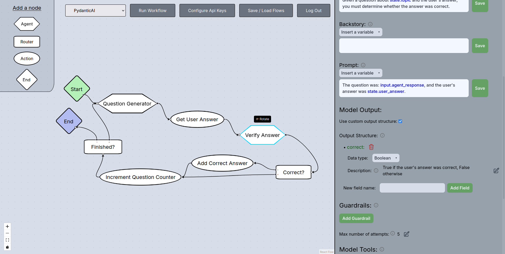
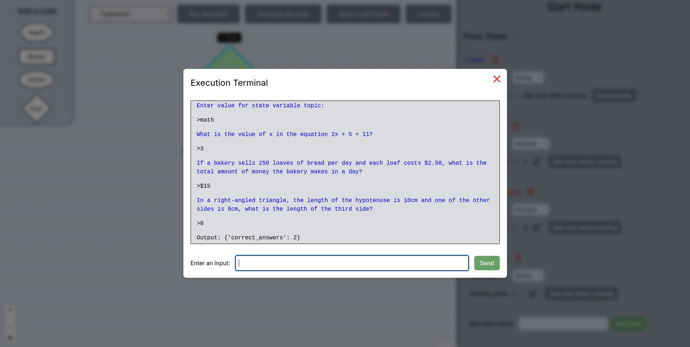

# Graph-based Agentic Workflow Design Framework
A no-code web platform that allows users to design and execute agentic workflows following the Graph-based Agentic Workflow Design (GAWD) Framework. Work in progress.

## Graph-Based Language
Users design agentic workflows using a simple, graph based modeling language. Users can create, modify and connect nodes to define the expected behavior of the workflow. There are 5 types of node:
- *Start Node*: Entrypoint for the program. A workflow must have exactly one Start node.
- *Agent Node*: Represents a call to an AI agent.
- *Router Node*: Checks conditions to determine what path the execution will follow.
- *Action Node*: Modifies State variables.
- *End Node*: Marks the end of the program. All paths in the graph must lead to an End node.

### The Worflow State
A workflow has a set of global variables that can be accessed from every node. The starting value for these variables can be hardcoded in the workflow's design or asked from the user at the start of the execution. The starting value can later be modified in an Action node. All state variables have a DataType that determines the kind of information they can hold, and that can't be changed. There are three possible DataTypes:
- *Number* variables are represented in red, and hold a numeric value.
- *String* variables are represented in blue, and hold text.
- *Boolean* variables are represented in green, and can be either True or False.
The workflow State variables can be modified from the Start node editing menu.

### Node Inputs
In addition to the State variables, each node has access to its input variables, which correspond to the output of the previous node. This allows nodes to propagate information through the graph without constantly modifying the State. If a node has several predecessors, its input structure corresponds to the intersection of all the predecessors' output schemas.

### Agent Nodes
Agent nodes represent a call to an agent. An Agent's parameters can be configured from the node editing menu.
- An agent uses a language *Model*.
- Agents have three system prompts: *Role, Goal and Backstory*. Variables from the workflow State and the node's input can be embedded into these prompts, and their value will be updated every time the agent is called.
- The agent's task is provided in a user *Prompt*. Variables from the workflow State and the node's input can be embedded into this prompt, and their value will be updated every time the agent is called.
- Agents can have *Memory* of previous interactions within the same workflow execution.
- By default, agents produce a response String. Users can also define a custom *Output Structure*, providing DataTypes and descriptions for each field to help the agent interpret their meaning.
- *Guardrails* validate the agent's output by checking a list of conditions. If one of the conditions isn't fulfilled, a feedback message can be used to prompt the agent to try again. Guardrail conditions can use variables from the State, the agent's output, and the node's input, as well as values asked from the user during the execution. This enables users to manually validate the agent's output before proceeding. 
- A custom *Maximum Number of Attempts* prevents excessive token use and infinite loops when an agent repeatedly fails to pass all guardrail checks or produce a response using the correct output structure.
- Agent *Tools* allow agents to perform specific actions if they so choose. A list of pre-made tools is available, and technical users can easily add their own.
- Agents can draw from a series of *Knowledge Sources* to extract the information needed to fulfill their tasks. Currently, .txt and .md files can be used as knowledge sources.
- Agents can call on other agents dynamically through *Handoffs*. Agents that can be called through handoffs can be both connected or disconnected from the graph, and the user can provide a description that will help the rest of the agents decide whether to use the handoff. If the agent is disconnected from the graph, users can specify handoff input structure that will act as the node's input (it can be used when defining the agent's role, goal, backstory and guardrails). Additionally, users can define a prompt that will be used when the agent is called through a handoff. Otherwise, the prompt will be provided by the calling agent. After a handoff call is complete, control returns to the calling agent. The graph-based order of execution for the nodes is not affected by handoffs.

The agent's output is used as the node's output, and is passed as input to the next node.

### Router Nodes
Router nodes have several outgoing graph edges, each corresponding to a *Condition*. These conditions are checked in order, and the first one that's fulfilled determines which of the outgoing edges is followed. A no-code interface allows users to easily define conditions, using hardcoded values, variables from the workflow State, the node's input, and values asked from the user during the execution. A router can output a selection of its own input variables and pass them on to the next node.

### Action Nodes
Action nodes modify State variables through *Actions*. Each action computes a value and assigns it to a State variable. A no-code interface allows users to easily define actions, using hardcoded values, variables from the workflow State, the node's input, and values asked from the user during the execution. An agent node can output a selection of its own input variables and pass them on to the next node.

### End Nodes
End nodes define the output of the workflow by selecting variables from the workflow State and the node's input. 

## Validation and Execution
Users can run their agentic workflows directly from the platform. Once the worflow design is complete, users can choose from a selection of agentic programming frameworks (currently, CrewAI and PydanticAI) to use to run the workflow. A model validator will check the correctness of the graph, informing the user of any errors or patterns that are inappropriate for their selected target framework. Once the model is validated, it's automatically translated into code in the target framework and executed. Through the built-in Execution Terminal, users can see the workflow being executed in real time and input any values that the nodes require for their tasks.  

Users must provide the API keys that will be needed for the workflow's execution.

## User Accounts
Users that create an account with a username and password can save and load their workflow designs to have them persist across sessions. Registered users can choose whether to save their API keys or to enter them every session.

### Credits
This project uses [Heroicons](https://heroicons.com/) by Tailwind Labs.